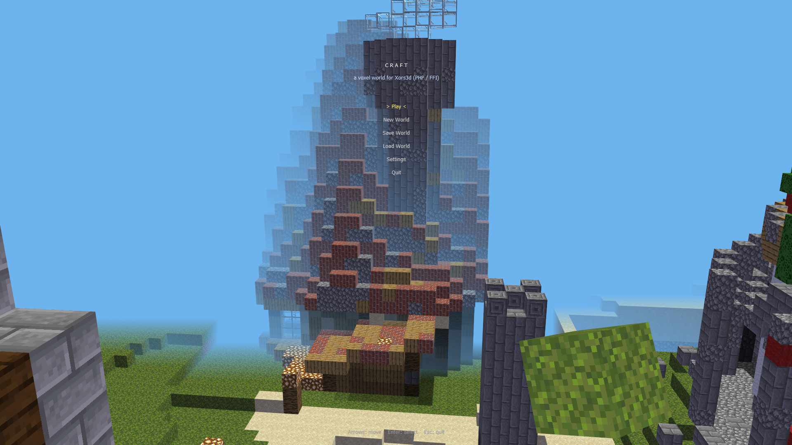
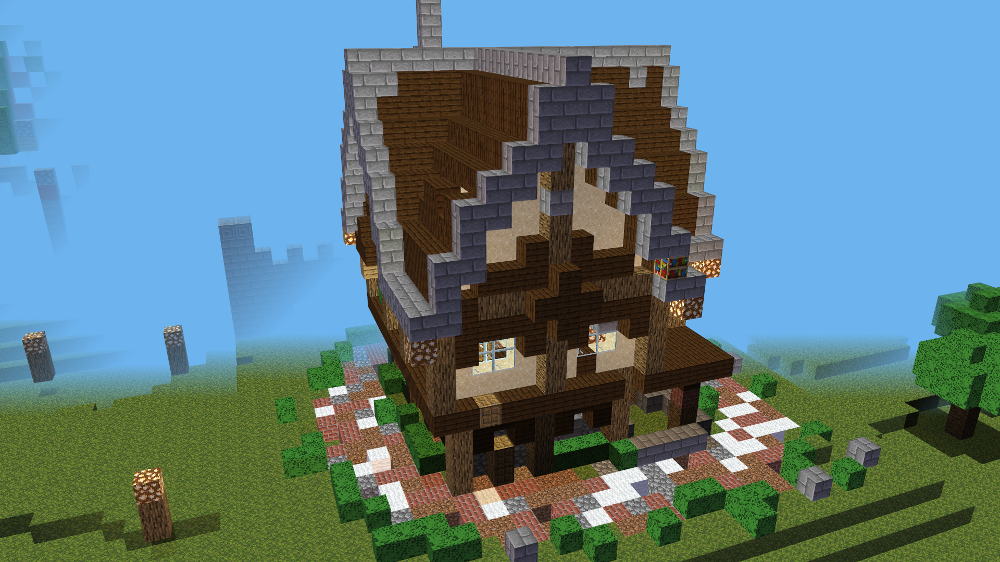
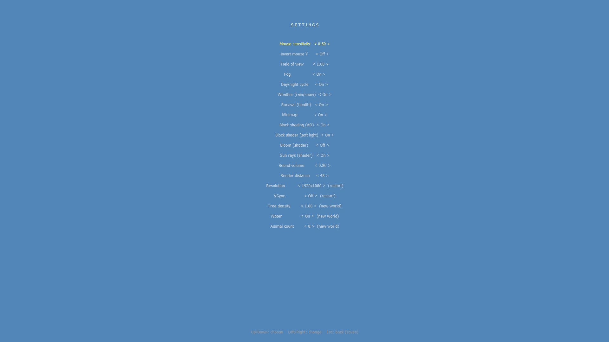

# Xors3d + PHP (FFI)

Полноценная работа со старым 3D-движком **Xors3d Indie 7.50** прямо из **PHP 8.5**
через **FFI** — без единой строчки C/C++. В комплекте:

- **ООП-каркас** (PSR-4 автолоадер, роутер, контроллеры, DI);
- **типизированный биндинг** ко всем ~1034 функциям движка и 427 константам
  (сгенерирован из C-заголовка, парсинга в рантайме нет);
- **порт всех 32 официальных примеров** SDK на PHP;
- собственная **воксельная игра «Craft»** в духе Minecraft (меню, настройки,
  генерация мира, биомы, вода, деревья, ходьба с гравитацией, разрушение и
  стройка, инвентарь, звук, сохранение мира).

Репозиторий **самодостаточный**: в него включены 32-битная сборка PHP
(`phpx86/`), сам движок и его DLL, а также SDK с медиа — то есть после клона
всё запускается без установки чего-либо.

## Скриншоты

Игра «Craft» (маршрут `minecraft`):







## Быстрый старт

Windows, из корня репозитория:

```bat
craft.bat             :: воксельная игра «Craft» напрямую (двойной клик)
run.bat minecraft     :: то же самое через общий лаунчер
run.bat               :: меню-лаунчер всех демок
run.bat simple        :: конкретная демка
run.bat info          :: информация о движке (без окна)
```

`run.bat` запускает всё бандлированным 32-битным PHP (`phpx86/php.exe`),
в котором уже включён FFI (`phpx86/php.ini`).

## Игра «Craft»

- **Меню**: Play / New World / Save World / Load World / Settings / Quit
  (стрелки + Enter), с живым вращающимся миром на фоне.
- **Настройки** (сохраняются в `xors3d-php/craft-settings.json`):
  чувствительность мыши, инверсия Y, FOV, туман, день/ночь, **bloom** и
  **лучи солнца (god rays)** — шейдеры, громкость звука, дальность прорисовки
  (вживую); разрешение и vsync (при перезапуске); размер
  мира (до 128), деревья, вода, число овец (при New World).
- **Биомы**: равнины и пустыни — плоские и открытые (удобно строить), леса —
  с деревьями, горы — высокие со снежными шапками и голым камнем. Биом задаётся
  низкочастотным шумом и влияет на высоту, поверхность (трава/песок/снег/камень)
  и плотность деревьев.
- **Бесконечный генеративный мир**: терраин, руды и деревья считаются
  процедурно на лету для любых координат; блоки-сущности создаются только в
  чанках вокруг игрока и освобождаются при отдалении (стриминг). Идёшь — мир
  генерируется дальше без конца; память и FPS не зависят от пройденного пути.
  Под землёй/вдали ничего не рисуется зря, туман маскирует границу. Дальность —
  ползунок «Render distance» (меньше = стабильные 60).
- **Greedy-меширование чанков**: каждый чанк — один меш; видимые грани
  объединяются в большие квады (соседние одинаковые грани сливаются), скрытые
  грани не строятся. На порядок меньше draw calls и вершин, чем отдельные кубы,
  — стабильные ~60 FPS даже на большой дальности. (Узкое место было в числе
  сущностей, а не в FFI: замер ~3 млн FFI-вызовов/сек, бюджет ~50k на кадр.)
- **Туман** отодвинут: чистая видимость на большей части дальности прорисовки,
  в дымку уходит лишь дальний край.
- **Пещеры**: подземные полости и туннели (3D value-шум) под сплошной коркой
  поверхности — есть что копать и исследовать.
- **Освещение (skylight)**: грани, не видящие небо (пещеры, под навесами, интерьеры),
  затемняются — запечено в вершинные цвета поверх динамического дня/ночи. Светокамень
  светится. Тёмные пещеры и уютные интерьеры.
- **Свет от факелов**: пул из 5 точечных источников каждый кадр переназначается на
  ближайший к игроку светокамень/факелы — тёплые пятна реального света на стенах
  ночью и в пещерах.
- **Руды**: уголь, железо и алмаз (глубоко и редко) генерируются в камне и
  проявляются при копании.
- **Партиклы разрушения**: при ломании блока разлетаются текстурированные осколки.
- **Детёныши**: ~20% животных рождаются уменьшенными (baby).
- **Мир**: процедурная генерация многооктавным шумом (FBM) — холмы, горы со
  снежными шапками, озёра в низинах, песчаные пляжи; деревья, анимированная
  полупрозрачная вода.
- **Погода**: динамическая смена ясно / **дождь** / **снег** (снег — в холодных
  биомах и на высоте). Осадки — падающие билборды вокруг игрока; при дожде мир
  затягивает пасмурная дымка, поверхности мокро блестят и на плоских участках
  собираются **лужи**; снег со временем **ложится** на поверхности (верхушки
  блоков белеют) и тает, когда распогодится. Переключается в настройках («Weather»).
- **Рельеф**: пологие холмы и перепады высот по всему миру (не только в горах);
  на подъёмы в один блок игрок **всходит автоматически** (авто-шаг), как по
  ступеням. Туман доведён до края зоны прорисовки — далеко видно, а подгрузка
  чанков скрыта в дымке (без «мигания» карты на границе).
- **Постройки на старте**: вокруг точки спавна на ровной площади стоят готовые
  здания — **деревянный дом** (окна, дверь, кровать, книжные полки, лампа),
  каменный **замок** (стены с зубцами, четыре башни, ворота, тронный зал) и
  **сторожевая башня** с маяком. Новые строительные блоки (булыжник, каменные
  кирпичи, доски, тёмные доски, книжная полка, шерсть, резной камень) доступны в
  хотбаре (колесо мыши). Ассеты — из набора `Default-assets`.
- **Импорт построек Axiom (`.bp`)**: блюпринты из `Default-assets/schematics`
  конвертируются (`bin/convert_bp.php`) в компактный JSON и ставятся на спавне
  (дом берёзовый, средневековый, храм). Блоки Minecraft маппятся на блоки Craft.
- **Процедурные постройки**: по мере исследования мира по нему детерминированно
  разбросаны здания-ориентиры (дома, замки, ворота, храм, водонапорная башня) —
  не ближе ~56 блоков друг к другу, на ровной суше, с рабочими дверьми. Огромные
  блюпринты (готический собор, штаб порта) в авто-генерацию не идут ради FPS.
- **Парящий остров**: гигантский блюпринт-остров (скала со строениями) висит в небе
  над деревней на спавне как ориентир. Меш-высота (`Y_MAX`) поднята, но чанки строятся
  только до реальной высоты контента, поэтому обычные чанки не тяжелее.
- **Двери**: устанавливаются (блок в хотбаре/крафт-меню), открываются/закрываются
  на **E**; в импортированных зданиях двери тоже рабочие.
- **Сундуки**: ставятся, открываются на **E** — меню с двумя панелями (сундук ↔
  инвентарь), Tab переключает, Enter/ЛКМ перекидывает стак. Содержимое сохраняется
  с миром; при поломке сундука вещи возвращаются в инвентарь.
- **Прозрачные окна**: стекло — маскируемая текстура и не перекрывает обзор, сквозь
  него видно.
- **Выживание: инвентарь + крафт**: у блоков в хотбаре есть **счётчик** (красный, если
  пусто). Ломаешь блок — он падает в инвентарь (трава→земля, камень→булыжник), ставишь —
  расходуется. Клавиша **C** — меню крафта по рецептам (бревно→доски, доски→двери/полки,
  булыжник→кирпичи, песок→стекло и т.д.): показывает «нужно (есть)» и подсвечивает
  доступные. Стартовый набор блоков выдаётся в новом мире; инвентарь сохраняется.
- **Деревья** расставлены с минимальной дистанцией (Poisson-disk): кроны больше
  не накладываются друг на друга.
- **Выживание (здоровье)**: 10 сердец, урон от **падения** (с высоты >3.5 блоков) и
  **утопления** (кончается воздух под водой — синие пузырьки), медленная регенерация,
  смерть → респавн. В полёте (F) урона нет; отключается настройкой «Survival».
- **Мобы**: мирные блочные животные — **овца, свинья, корова, курица, кролик** —
  бродят по миру (простой ИИ, следование рельефу, у каждого своя скорость). Агрессивных
  нет: боевой механики (оружие/урон) в игре нет.
- **Управление**: `WASD` + мышь; `F` — ходьба/полёт (в ходьбе гравитация,
  коллизия, прыжок `Space`); `ЛКМ` — ломать, `ПКМ` — ставить; `1–9` или колесо
  мыши — выбор блока; `Esc` — в меню.
- **Интерфейс**: визуальный хотбар с иконками блоков и рамкой выбора, прицел,
  держимый блок «в руке».
- **Звук**: ломание, установка, шаги и зацикленный эмбиент-ветер
  (синтезируются `xors3d-php/bin/gen_sounds.php`).
- **Save/Load** построенного мира в `xors3d-php/craft-world.json`.
- Текстуры — настоящие 16×16 тайлы Minecraft в `xors3d-php/assets/blocks/`.

## Структура

```
.
├─ run.bat                    Лаунчер (32-бит PHP + фронт-контроллер)
├─ phpx86/                    Бандлированный 32-битный PHP + php.ini (FFI on)
├─ Xors3dIndie(withSamples)_750/   SDK движка: dlls, headers, samples, media
├─ Default-assets/            Текстуры Minecraft (исходные, для ассетов)
├─ docs/screenshots/          Скриншоты для README
└─ xors3d-php/                PHP-проект
   ├─ app.php                 Точка входа (фронт-контроллер)
   ├─ routes.php              Авто-дискавери контроллеров -> маршруты
   ├─ bin/generate.php        Кодоген: xors3d.h -> src/Ffi/*.php
   ├─ bin/gen_sounds.php      Синтез WAV-звуков
   ├─ assets/                 blocks/ (текстуры) + sounds/ (WAV)
   └─ src/
      ├─ autoload.php         PSR-4 автолоадер (Xors3D\)
      ├─ Core/                Application, Router, Controller, Config
      ├─ Ffi/                 NativeLibrary + ГЕНЕРИРУЕМЫЕ Engine.php / Constants.php
      ├─ Scene/               Entity, Camera, Cube, Texture, MouseLookCamera, Skybox…
      └─ Controllers/         По контроллеру на демку (32 примера + info + minecraft)
         └─ Craft/            Логика игры «Craft», разнесённая по трейтам:
                              TerrainGen, Mobs, Weather, Inventory, Chunks,
                              Structures, Sky, Player, Effects, Ui, Assets, World
                              (MinecraftController ~500 строк — только каркас + gameLoop)
```

## Как это работает

Xors3d.dll экспортирует плоские C-функции с соглашением `__stdcall`. На 32-битной
Windows их имена декорированы как `_имя@N`. У встроенной авто-декорации PHP FFI
есть баг (падение на функциях без аргументов), поэтому символы резолвятся вручную
через `GetProcAddress` по точному имени, а адрес приводится к типизированному
указателю через `FFI::cast()` — это штатное использование FFI. Требуется
**32-битный** PHP, так как все DLL движка — x86.

Биндинг генерируется один раз из `headers/CPP/inc/xors3d.h`:

```bat
phpx86\php.exe xors3d-php\bin\generate.php
```

## Демки (порт Samples/Source/C++)

Все 32 примера SDK доступны как маршруты `run.bat <имя>`:

`animtex army blank bloom bump butterfly clipplane cubemap dof editor forest fx
glass instancing instancing2 meshesintersect pick pointing psystem px r2i r2t
rwpixel shadows simple skinning splatting stretchbb surface sysinfo terrain water`

## Требования

- Windows;
- всё остальное включено в репозиторий (PHP, движок, DLL, медиа).
